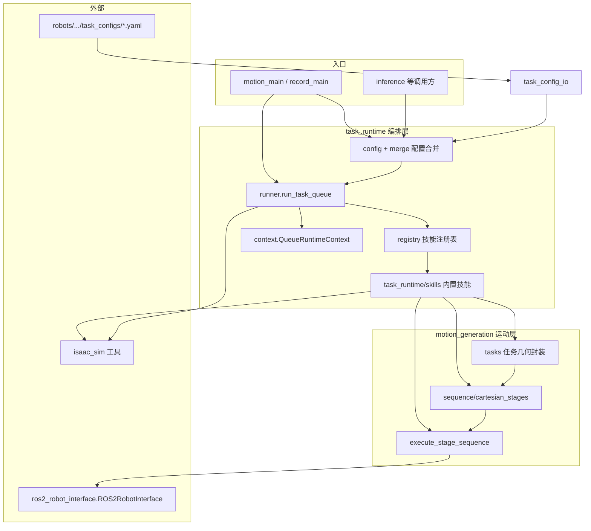

# robot-action-composer

在 **ROS 2** 上编排 **任务队列**（YAML 块 + 技能注册表），把几何与参数变成 **`StageTarget` 序列**并通过 **`ROS2RobotInterface`** 执行；可选接入 **LeRobot 数据集录制**。

---

https://github.com/user-attachments/assets/4c3bcf28-f2cd-4c47-83a0-ecccb30c1891

---

## 1. 文档

| 文档 | 内容 |
|------|------|
| **本 README** | 包简介、**运行环境**（Python 3.12 / ROS 2 Jazzy）、**架构与调用关系**（分层、`task_queue`、技能注册表）、安装与依赖约定 |
| [docs/SKILLS_REFERENCE.md](docs/SKILLS_REFERENCE.md) | 各技能参数、默认值与 YAML 示例 |
| [docs/TASK_CONFIG_YAML.md](docs/TASK_CONFIG_YAML.md) | 任务 YAML 格式、`skill_defaults` / `skill_params`、加载与合并规则 |
| [docs/ROBOT_CONFIG.md](docs/ROBOT_CONFIG.md) | `robot.yaml` / `lerobot_config.py` 与 `robots/` 目录约定 |

monorepo 内 **Isaac Sim 环境、USD、工作空间** 步骤见 **`examples/IsaacSim/README.md`**。

---

## 2. 架构与设计

### 2.1 定位

**robot_action_composer** 在 monorepo 中承担：

- **运动层**：把任务几何与机器人约束变成 **`StageTarget` 序列**，并通过 **`ROS2RobotInterface`** 执行（笛卡尔 / 双臂同步 / MoveJ 等）。
- **编排层**：用 **`task_queue`**（YAML 中的块列表）+ **技能注册表** + **运行时上下文**，把多段运动按顺序（或并行块）跑通；按结构化叠层合并 **`skill_defaults` / `skill_params`**。
- **周边**：Isaac Sim 实体位姿、仿真 reset、与 **LeRobot 录制**（可选 extra）的衔接。

**不在本包内实现**：底层 OCS2 / MPC、Nav2 服务器本体；本包通过已有 ROS 2 接口与仿真服务交互。

**约定**：纯运动/队列路径只依赖 **`ROS2RobotInterface`**（`ctx.interface`），不依赖 **`ROS2Robot`** 类。导航由 `task_runtime/skills/navigation.py` 封装 Nav2，基座位姿等可配合 `isaac_sim` 实体服务。

### 2.2 分层与调用关系



**一句话**：**`motion_generation`** 负责「每一段运动长什么样、怎么发到机器人」；**`task_runtime`** 负责「按队列调用哪几个技能、Context 里传什么、配置怎么叠」。

### 2.3 motion_generation（运动层）

**`motion_generation/sequence/`**

- **`cartesian_stages.py`**：核心类型与流水线。
  - **`StageTarget` / `ArmTarget` / `ArmStage`**、**`SendMode`**、**`ExecutionMeta`**（与 `task_runtime.types.ExecutionMeta` 配合）。
  - **通用 builder**：`build_single_arm_pick_sequence`、`build_single_arm_place_sequence`、`build_handover_sequence`、`build_bimanual_carry_sequence` 等。
  - **`execute_stage_sequence`**：按段调用 `ROS2RobotInterface`（单臂 / 双臂 stamped 等），处理到达等待、夹爪节拍等。
- 公开符号经 **`sequence/__init__.py`** 再导出。

**`motion_generation/tasks/`**（在 sequence 之上做任务专用几何与薄封装）

| 模块 | 作用 |
|------|------|
| `handover.py` | **`HandoverSyncConfig`** + `build_handover_sync_sequence`（双臂交接同步段） |
| `bimanual_carry.py` | **`BimanualCarryTaskConfig`** + 对 `build_bimanual_carry_sequence` 的封装与队列切片辅助 |
| `bimanual_parallel_pick.py` | 双臂并行抓取配置与 **`build_bimanual_parallel_pick_record_sequence`**（**`dual_arm.parallel_pick`**） |
| `drawer.py` | 抽屉 prim 几何、**`DrawerGeometryConfig`**、抽屉相关阶段构造 |
| `pick_place.py` | 与实体服务相关的 place 解析等（队列单臂切片参数主要在 `task_runtime.config.single_arm`） |
| `movej_return.py` | 捕获关节角、`movej_return_to_initial_state`；**`task_queue` 技能已移除**，仍由 **`dataset_recording`** 在回合间调用 |

### 2.4 task_runtime（编排层）

**运行时入口**

- **`runner.run_task_queue`**：连接机器人 → FSM → 可选环境 reset → 构造 **`QueueRuntimeContext`** → 顺序执行 `task_queue` 各块（支持 **`ParallelSpec`** 并行子块）→ 每块 **`get_skill` → `execute_stage_sequence`**。

**技能与注册表**

- **`registry.py`**：`register_skill(name, fn)` 写入全局表，`get_skill(name)` 供 **`runner`** 按块内 **`skill`** 字符串解析。
- **`task_runtime/skills/`**：子模块 import 时副作用注册；未知技能名在 **`get_skill`** 时抛出 **`KeyError`**（错误信息含已注册名列表）。

**参数、默认值、YAML 写法与备注**以 **[docs/SKILLS_REFERENCE.md](docs/SKILLS_REFERENCE.md)** 为**完整配置说明**；下表仅作技能名索引与实现文件对照（与代码 `register_skill` 一致）。

| 注册名（`task_queue` → `skill`） | 定义文件（`task_runtime/skills/`） | 概要 |
|----------------------------------|--------------------------------------|------|
| `single_arm.pick` | `single_arm.py` | 单臂抓取序列（接近 / 闭合 / 回撤等） |
| `single_arm.move_to_object` | `single_arm.py` | 单臂移动到物体相对笛卡尔目标（无抓取序列） |
| `single_arm.place` | `single_arm.py` | 单臂放置序列 |
| `single_arm.move_to_pose` | `single_arm.py` | 单臂显式笛卡尔位姿（MoveL） |
| `single_arm.goto_cache_pose` | `single_arm.py` | 单臂回到 `robot.cache_ee_pose` 缓存（含从双臂缓存选侧） |
| `single_arm.drawer.pull_open` | `drawer.py` | 拉开抽屉 |
| `single_arm.drawer.close_push` | `drawer.py` | 推合抽屉 |
| `dual_arm.carry` | `dual_arm.py` | 双臂搬运完整序列 |
| `dual_arm.parallel_pick` | `dual_arm.py` | 双臂并行抓取 |
| `dual_arm.bimanual_align` | `dual_arm.py` | 持箱双臂对齐（中点 + 可选姿态增量） |
| `dual_arm.place` | `dual_arm.py` | 双臂相对放置（平移 / 外张 / 后撤等） |
| `dual_arm.handover` | `dual_arm.py` | 双臂交接同步段 |
| `dual_arm.goto_cache_pose` | `dual_arm.py` | 双臂同步回到 `robot.cache_ee_pose`（`which: both`） |
| `nav.send_nav_goal` | `navigation.py` | 非阻塞发送 Nav2 目标 |
| `nav.wait_nav_arrived` | `navigation.py` | 等待导航到达 |
| `nav.navigate_to_pose` | `navigation.py` | 导航到给定位姿（封装发送 + 等待） |
| `nav.navigate_to_object` | `navigation.py` | 导航到物体附近位姿 |
| `nav.navigate_relative` | `navigation.py` | 相对当前机器人位姿的平面运动 |
| `joint.movej_to_config` | `joint.py` | MoveJ 到给定关节配置 |
| `joint.goto_cached_joints` | `joint.py` | 回到 `robot.cache_joint_state` 缓存关节角 |
| `session.scratch_put` | `session.py` | 写入通用 `scratch` 键值 |
| `session.scratch_clear` | `session.py` | 清空 `scratch` |
| `robot.cache_ee_pose` | `session.py` | 缓存末端位姿（供 `goto_cache_pose`） |
| `robot.cache_joint_state` | `session.py` | 缓存关节状态（供 `joint.goto_cached_joints`） |
| `robot.snapshot_state` | `session.py` | 机器人状态快照（调试用） |
| `env.randomize_object_local_xyz` | `env.py` | 仿真中物体局部位置随机化 |

每个 skill 的函数签名约定：**`(ctx, params) -> (list[StageTarget], ExecutionMeta)`**；无笛卡尔阶段时返回空列表（例如纯导航、纯 MoveJ / 仅副作用块）。

**上下文与类型**

- **`context.QueueRuntimeContext`**：会话（**`interface`**、**`robot_cfg`**、**`sim_time`**、合并后的 **`task_cfg`**（`QueueSingleArmSlice`）、**`drawer` / `drawer_geometry`**、**`handover_sync`**（类型 **`HandoverSyncConfig`**，技能 **`dual_arm.handover`**）、**`carry_task_cfg` / `carry_object_position`**、**`place_object_position`**、**`parallel_pick_target_poses`**、**`scratch`** 等）。
- **`types.py`**：**`BlockSpec`**、**`ParallelSpec`**、**`ExecutionMeta`**、`block_spec_from_mapping`（YAML dict → 块对象）。

**配置与合并**

- **`config/single_arm.py`**：**`QueueSingleArmSlice`**（`common` / `pick` / `place`）及块参数 overlay。
- **`config/merged.py`**：**`MergedQueueConfig`**：从 `runtime_defaults` + `skill_defaults` + `scene_presets.skill_params` 构建单臂切片 + 可选 **`carry` / `handover` / `drawer`**；**`drawer` 相关类型在 `_try_drawer` 内延迟 import**，避免与 `motion_generation.tasks.drawer` 循环依赖。
- **`merge/block_params.py`**：按块合并最终 **`params`**（**`merge_task_queue_skill_params`**）。

### 2.5 配置发现与其它模块

- **`task_config_io.py`**：扫描 **`task_configs/*.yaml`**，**`queue_root_overrides`**（禁止根级嵌套 `pick`/`place`/`handover`/`carry`/`drawer` 等）。
- **`discovery/registry_loader.py`**：扫描 **`robots/*/`** 与 **`robots/*/*/`**（一层厂商分组）下的 `robot.yaml` + `task_configs/`，供 CLI / inference。

| 路径 | 作用 |
|------|------|
| **`isaac_sim/`** | 仿真 reset、实体位姿服务、`SimTimeHelper` 等 |
| **`ros_interface_utils.py`** | 从机器人配置构造 **`ROS2RobotInterface`**、handler 辅助 |
| **`cli/motion_main.py` / `record_main.py`** | 运动与录制入口（`MergedQueueConfig` → `run_task_queue` 或录制管线） |

**CLI（安装后可用）**

```bash
# 在含 robots/ 的工作区目录下（如 examples/IsaacSim）
cd examples/IsaacSim
motion-generation

# 非交互
motion-generation --robot dobot_cr5 --task-key pick_place --scene default

# 指定工作区根（默认 cwd）
motion-generation --workspace /path/to/workspace --robot dobot_cr5 --task-key pick_place

# 界面语言（zh / en；也可用环境变量 MOTION_GENERATION_LANG）
motion-generation --lang zh
# 交互模式：配置菜单选 3「偏好设置」（有上次选择时为 4），可配置语言与 object-resolution JSON 录制
```

`motion-generation` 扫描 `workspace_dir/robots/` 下扁平或一层分组（`robots/<Vendor>/<Robot>/`）的 `robot.yaml` 与 `task_configs/`；默认 `workspace_dir` 为当前工作目录。上次选择与偏好（`lang`、`record_object_resolution_json` 等）缓存在工作区根目录的 **`.motion_last.json`**（已加入 `.gitignore`）。语言优先级：`--lang` > `MOTION_GENERATION_LANG` > `.motion_last.json` 中的 `lang` > 系统 `LANG`。仿真是否录制 object-resolution JSON 由偏好中的 `record_object_resolution_json` 决定（默认 `false`）；传入 `--object-resolution-json` 时仍会强制录制到指定路径。
| **`dataset_recording/`** | `[recording]` extra：**`ROS2Robot`**、episode 写入；运动中仍走 **`robot.ros2_interface`** |

### 2.6 依赖关系要点

- **录制**额外依赖 **`lerobot_robot_ros2`** 等（可选安装）。

**文档维护**：YAML / 机器人配置与技能参数以本包 **`docs/`** 为准；`examples/IsaacSim/docs/TASK_CONFIG_YAML.md` 若存在仅为跳转页。

---

## 3. 运行环境

- **Python**：**3.12**（与本 monorepo 在 **ROS 2 Jazzy** 下的开发/运行环境一致，避免与 Jazzy 附带的 `rclpy`、消息包、工具链错配）。
- **ROS 2**：**Jazzy**；请在已 `source` 对应 `install/setup.bash`（或工作区覆盖层）的 shell 中安装与运行，使 `rclpy`、`cv_bridge` 等来自**当前**发行版/工作区，而不是与系统/其他 ROS 版本混用。

其他 ROS 2 发行版或不同 Python 小版本**可能**可用，但**不**作为本仓库的约定基线；遇依赖或类型问题请优先回到 **Python 3.12 + Jazzy** 复现与排查。

---

## 4. 安装

在 monorepo 根目录推荐使用 **`./init.sh`**（见主仓库 README）：

```bash
./init.sh all-motion          # 仅任务编排（interface + robot_action_composer）
./init.sh install-lerobot     # 额外：PyTorch + lerobot + 插件（录制 / 推理）
# 或一次性：./init.sh all
```

手动安装（路径按你的仓库为准），**先满足上文第 3 节「运行环境」**：

```bash
pip install -e submodules/ros2_robot_interface
pip install -e submodules/robot_action_composer
```

需要录制 / 推理时再装：

```bash
pip install -e lerobot_robot_ros2
pip install -e lerobot_camera_ros2
pip install "lerobot==0.5.1"
```

机器人配置拆分为 `robot.yaml`（任务编排）与 `lerobot_config.py`（可选），见 [docs/ROBOT_CONFIG.md](docs/ROBOT_CONFIG.md)。

---

## 5. 备注

**`motion_generation/`** 不依赖 LeRobot。四元数与位姿通用工具均在 **`ros2_robot_interface.utils.quat_pose`**（本包 `drawer` 技能、`isaac_sim` 等直接向接口包取 **`pose_from_tuple`** 等）。
