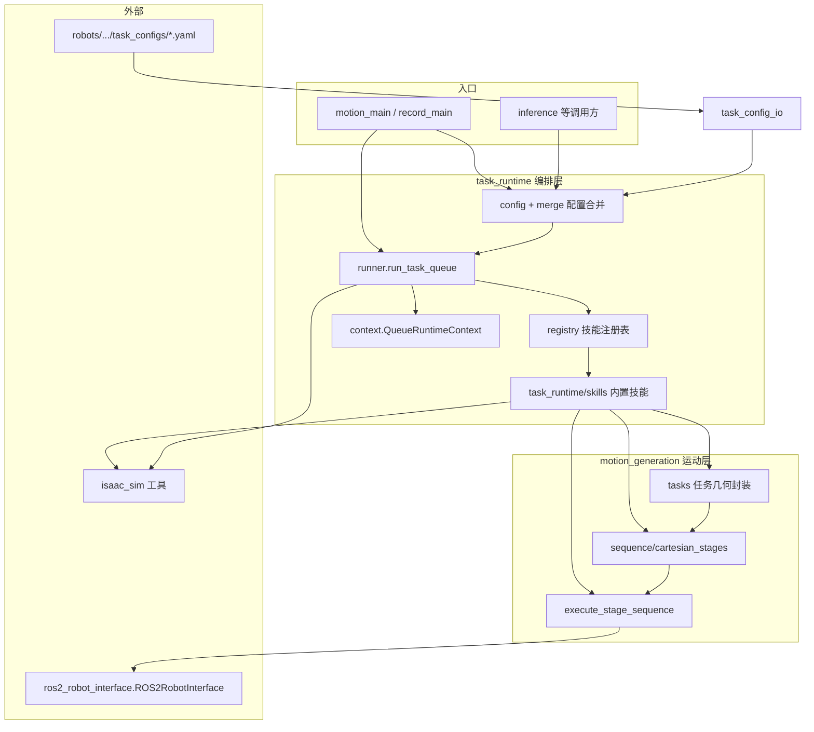

# robot_action_composer 架构设计

本文描述子模块 **`robot_action_composer`** 当前的分层职责、主要包内模块与一次任务执行的调用关系。**任务 YAML** 与 **`robot_config.py` 约定**见同目录 **[TASK_CONFIG_YAML.md](TASK_CONFIG_YAML.md)**、**[ROBOT_CONFIG.md](ROBOT_CONFIG.md)**；文档入口见包根目录 **`README.md`**。Isaac Sim 环境与 USD 步骤见 monorepo 内 **`examples/IsaacSim/README.md`**。

---

## 1. 定位

**robot_action_composer** 在 monorepo 中承担：

- **运动层**：把任务几何与机器人约束变成 **`StageTarget` 序列**，并通过 **`ROS2RobotInterface`** 执行（笛卡尔 / 双臂同步 / MoveJ 等）。
- **编排层**：用 **`task_queue`**（YAML 中的块列表）+ **技能注册表** + **运行时上下文**，把多段运动按顺序（或并行块）跑通；合并 **`skill_defaults` / `skill_params`** 与扁平 preset。
- **周边**：Isaac Sim 实体位姿、仿真 reset、与 **LeRobot 录制**（可选 extra）的衔接。

**不**在本包内实现：底层 OCS2 / MPC、Nav2 服务器本体；本包通过已有 ROS 2 接口与仿真服务交互。

---

## 2. 分层总览

**一句话**：**`motion_generation`** 负责「每一段运动长什么样、怎么发到机器人」；**`task_runtime`** 负责「按队列调用哪几个技能、Context 里传什么、配置怎么叠」。

---

## 3. motion_generation（运动层）

### 3.1 `motion_generation/sequence/`

- **`cartesian_stages.py`**：核心类型与流水线。
  - **`StageTarget` / `ArmTarget` / `ArmStage`**、**`SendMode`**、**`ExecutionMeta`**（与 `task_runtime.types.ExecutionMeta` 配合使用）。
  - **通用 builder**：`build_single_arm_pick_sequence`、`build_single_arm_place_sequence`、`build_handover_sequence`、`build_bimanual_carry_sequence` 等。
  - **`execute_stage_sequence`**：按段调用 `ROS2RobotInterface`（单臂 / 双臂 stamped 等），处理到达等待、夹爪节拍等。

该子包通过 **`sequence/__init__.py`** 再导出公开符号，便于 `from robot_action_composer.motion_generation.sequence import ...`。

### 3.2 `motion_generation/tasks/`

在 **sequence** 之上做**任务专用**几何与薄封装（避免把业务参数堆进 `cartesian_stages`）：

| 模块 | 作用 |
|------|------|
| `handover.py` | **`HandoverSyncConfig`** + `build_handover_sync_sequence`（双臂交接同步段） |
| `bimanual_carry.py` | **`BimanualCarryTaskConfig`** + 对 `build_bimanual_carry_sequence` 的封装与队列切片辅助 |
| `drawer.py` | 抽屉 prim 几何、**`DrawerGeometryConfig`**、抽屉相关阶段构造 |
| `pick_place.py` | 与实体服务相关的 place 解析等（队列单臂切片参数仍主要在 `task_runtime.config.single_arm`） |
| `movej_return.py` | 捕获关节角、`movej_return_to_initial_state`；**`task_queue` 技能已移除**，仍由 **`dataset_recording`** 在回合间调用 |

---

## 4. task_runtime（编排层）

### 4.1 运行时入口

- **`runner.run_task_queue`**：连接机器人 → FSM → 可选环境 reset → 构造 **`QueueRuntimeContext`** → 顺序执行 `task_queue` 中各块（支持 **`ParallelSpec`** 并行子块）→ 每块 **`get_skill` → `execute_stage_sequence`**。

### 4.2 技能与注册表

- **`registry.py`**：`register_skill(name, fn)` / `get_skill(name)`。  
- **`task_runtime/skills/`**（import 时副作用注册）：
  - **`single_arm`**：`pregrasp`、`pick`、`place`、**`goto_cache_pose`**（读 **`robot.cache_ee_pose`** 的单臂或双臂缓存中的**一侧**，笛卡尔回程）等。
  - **`dual_arm`**：`carry`；**`place`** / **`place_advance`** / **`place_release`** / **`place_spread_retreat`**（与 carry 几何互逆、相对货架 prim 的放置）；**`place_relative`**（相对当前双臂末端；可选 **`motion_frame_id`** 经 TF 在躯干系算几何并发目标，适配腰转后外张方向）；`handover_sync`、**`goto_cache_pose`**（双臂同步回 **`cache_ee_pose` `which: both`**）。
  - **`drawer`**：`single_arm.drawer.*` 系列。
  - **`navigation`**：Nav2 相关封装（与 `isaac_sim` 取位姿配合）。
  - **`joint`**：**`joint.movej_to_config`**、**`joint.goto_cached_joints`**（读 **`robot.cache_joint_state`** 写入的 **`scratch`**）。
  - **`session`**：**`session.scratch_put`** / **`session.scratch_clear`**（通用键值暂存）；**`robot.snapshot_state`**；**`robot.cache_ee_pose`**（**`which`**：`work` / `left` / `right` / **`both`**，配合 **`single_arm.goto_cache_pose`** 或 **`dual_arm.goto_cache_pose`**）；**`robot.cache_joint_state`**（配合 **`joint.goto_cached_joints`**）。

每个 skill 签名约定：**`(ctx, params) -> (list[StageTarget], ExecutionMeta)`**；无阶段则返回空列表（如部分 MoveJ 仅副作用）。

### 4.3 上下文与类型

- **`context.QueueRuntimeContext`**：一次队列运行的会话（**`interface`**、**`robot_cfg`**、**`sim_time`**、合并后的 **`task_cfg`**（`QueueSingleArmSlice`）、**`drawer` / `drawer_geometry`**、**`handover_sync`**、**`carry_task_cfg` / `carry_object_center`**、**`scratch`**（跨 skill 字典暂存 + **`scratch_get` / `scratch_put`**）等）。
- **`types.py`**：**`BlockSpec`**、**`ParallelSpec`**、**`ExecutionMeta`**、`block_spec_from_mapping`（YAML dict → 块对象）。

### 4.4 配置

- **`config/single_arm.py`**：**`QueueSingleArmSlice`**（`common` / `pick` / `place`）及块参数 overlay。
- **`config/merged.py`**：**`MergedQueueConfig`**：从扁平 dict 解析 **单臂切片 + 可选 `carry` / `handover`（`HandoverSyncConfig`）/ `drawer`**；**`drawer` 相关类型在 `_try_drawer` 内延迟 import**，避免与 `motion_generation.tasks.drawer` 循环依赖。
- **`merge/`**：`flatten` 与 **`skill_defaults` / `skill_params`** 叠层（pick/place、handover、carry、drawer）、**`block_params.merge_task_queue_skill_params`**（按块合并最终 `params`）。

---

## 5. 配置与任务发现（YAML / 机器人目录）

- **`task_config_io.py`**：扫描 **`task_configs/*.yaml`**，**`flatten_queue_task_overrides`**（禁止根键 `pick`/`place`/`handover`/`carry`/`drawer` 嵌套等规则）。
- **`discovery/registry_loader.py`**：对传入根目录下的 **`robots/*/robot_config.py`** + **`task_configs/`** 做发现，供 CLI / inference 使用。

详细约定见 **[TASK_CONFIG_YAML.md](TASK_CONFIG_YAML.md)**、**[SKILLS_REFERENCE.md](SKILLS_REFERENCE.md)**、**[ROBOT_CONFIG.md](ROBOT_CONFIG.md)**。

---

## 6. 其它包内模块

| 路径 | 作用 |
|------|------|
| **`isaac_sim/`** | 仿真 reset、实体位姿服务、`SimTimeHelper` 等 |
| **`ros_interface_utils.py`** | 从机器人配置构造 **`ROS2RobotInterface`**、handler 辅助 |
| **`cli/motion_main.py` / `record_main.py`** | IsaacSim 运动与录制入口（合并 flat → `build_merged_queue_from_flat` → `run_task_queue` 或录制管线） |
| **`dataset_recording/`** | `[recording]` extra：构建 **`ROS2Robot`**、episode 写入；运动中仍走 **`robot.ros2_interface`** |

---

## 7. 依赖关系要点

- **运行时运动路径**只依赖 **`ROS2RobotInterface`**（见根目录 `README.md` 说明）。
- **录制**额外依赖 **`lerobot_robot_ros2`** 等（可选安装）。
- **`isaac_sim`** 与 **`task_runtime/skills/drawer`** 使用 **`ros2_robot_interface.utils.quat_pose`**（**`motion_generation/`** 未用）。LeRobot 专用 **`action_from_pose` / rot6d** 等仍在 **`lerobot_robot_ros2.utils.pose_utils`**。

---

## 8. 文档版本

- 随包内目录与 API 调整更新；**YAML / 机器人配置**以本包 **`docs/`** 为准；`examples/IsaacSim/docs/TASK_CONFIG_YAML.md` 仅为跳转页。
